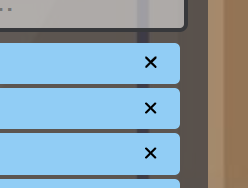

# to do list mini react projem 

bu projede kişi yapacağı görevleri veya işleri input kısmında yazıp gönderir ve daha sonra to do 
listesi dolamya başlar ve aşağıda sıralanır 

# todo list projesinin temel özellikleri 

* görev ekleyebilirsin 
* eklediğin görevleri işaretleyerek yapıldı şeklinde gösterip üstünü çizebilirsin
* yaptığın görevleri silebilirsin 
* tüm görevleri listeleyebilirsin
* sadece yapılmamış görevleri lsiteleyebilirsin
* sadece yapılmış görevleri listeleyebilirsin
* tüm görevleri tek aşamada silebilirsin
* görevlerin gösterildiği pencereyi açıp kapayabilirsin

# proje taslağı 

proje taslağında ana kısmı oluşturan 3 component oluşturulmuştur. 

en üstteki component  --> inputComponent
ortadaki listelenenleri göstereceğimiz component   --> ListComponent
en aşağıda footer bilgilerini göstereceğimiz compnent --> footerComponent

tüm verileri ortalamak için hepsini kapsayacak content componenti oluşturuldu 

form işlemleri hepsini kaplayan content işlemlerinde yapmak daha mantıklı olacaktır çünkü inputtan girilen veri farklı copmonentlerde kullanılmak üzere dağıtılıyor yani state ler orada bağlantı kuruyor o yüzden en ana ksıımda bunları yapmak daha mantıklı olur 

baktığımız zaman : 

tüm görevleri tutan içinde dizi bulunduran dizi  yapılacak verileri içinde tutuyor ve bu bilgiler 
hem input componentte  hem list componentte  hem de footer componentte kullanılıyor. 

* inputta veriler aktarılıyor 
* list te veriler listeleniyor
* footer de içindeki butonların kuralına göre listelenecek verilerin gözükmesini yapıyor 

# eklemeler 

* alt bileşenler (footer component için) :all - active completed - clear completed butonları eklendi :
 bu butonlar isimlerinden de anlaıldığı üzere hangi görevler listelenmesini düzenlemek  için eklendi

 

 her biri istenen doğrultuda verielri listelemeyi yarıyor 

 all için : 

active için : 

completed için : 

* eklenen her görevin bileşeni için silme (x) button u eklendi ve tıklayınca silebiliyoruz

* tüm listelenen bileşenleri göster / gizle  button u eklenerek istediğimizde gizleyebiliyoruz 

 
* proje bitmiş hali taslağı :

 //////////

 projeden yaptığım çıkarımlar 
 * props ve state yönetimini çok iyi kavradım 
 * verileri işlemeyi çok iyi öğrendim
 * component bileşenlerini yöentmeyi iyi kavradım 
 * props tanımlama yönünden kullanım yerlerine göre hangi yerde hiyerarşik sıralamada tanımlanması gerektiğini iyi kavradım 
* jsx tanımalmasına göre koşullu yazımları yazmayı iyi kavradım 
* bir projede dosyanın hiyerarşik yönetiminin nasıl sağlandığını iyi öğrendim
* veriye yapılacak işleme göre props içeriği tanımlamanın yönetimini yaptım ve bu düşünce sayesinde oldukça kullanılı bir yönetim elde ettim  neredeyse her şeyi state nin yapısına göre yapmayı başardım, mesela verinin checked edildiğini faklı yerde tanımalamk yerine bulunduğu etiketin içindeki input checked olduysa eğer bunun bilgisini state de saklayarak footer div de sadece checked  edilmiş ya da sadece checked edilmemeiş verileri lsitelemek isteğini footer divden göndererel list componentnde bu yapıları kullanarak rahatlıkla filtrelenmiş listelemeyi elde ettim

